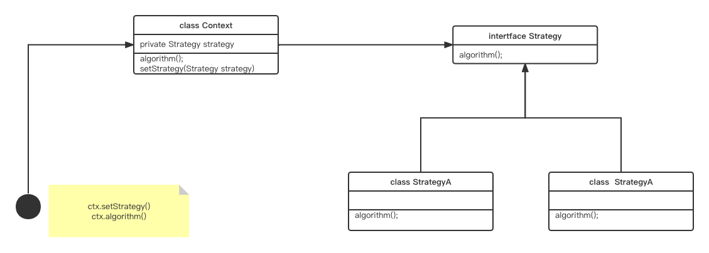

# IOC
```
DI:依赖注入
   DI是IOC的一种模式,被翻转控制的设置对象的依赖关系,将对象与其他对象连接起来
IOC:
    是软件工程中的一种原则,将对象和程序部分控制移动到容器和框架中

    

    有哪些机制实现控制反转:
    策略设计模式
    服务定位器模式
    工厂模式
    依赖注入（DI）


BeanFactory 提供框架基本功能, Bean创建 与注册,BeanFactory 就是Bean的一个大容器(singleton bean BeanDefiniton)
ApplicationContext 提供了更多企业的特定功能(ApplicationConext是一个完整的超集)


```
##  策略设计模式

```
概念:完成一项任务有多种不同的方式,通过环境,和选择不同的策略来完成该项目
```
## 服务定位器模式

```
JNDI(java name directory intertface)查找服务代价很高,在进行查找的时候将查找到的数据缓存起来
在次查找先去缓存查看一下是否存在
```


## 容器的概述
```
intertface ApplicationContext 提供了几个实现

 ClassPathXmlApplicationContext
 FileSystemXmlApplicationContext
 ......
```

### 配置源数据
```xml
配置源数据目的是告诉spring如何去实例化对象

bean(<bean> @Bean) 通常定义的是服务层的对象,或基础设置对象,通常不会在Bean中配置细粒度的Domain对象

<beans xmlns="xxxx">
    <bean id="" clas=""></bean>
</beans>
```
### 实例化一个容器
```
ApplicationContext context = new ClassPathXmlApplicationContext("services.xml", "daos.xml");

```
### 编写基于XML的配置源数据(import) 和 地址相关属性设置
```xml
<import resource="">  加载当前xml文件时从另一个xml文件文件加载BeanDefinition


<beans>
    <import resource="services.xml"/> 
    <import resource="resources/messageSource.xml"/>
    <import resource="/resources/themeSource.xml"/>

    <bean id="bean1" class="..."/>
    <bean id="bean2" class="..."/>
</beans>

note: 如论是否是地址和相对地址 都是从 resources 开始寻找

可以使用 ${} 来引用 系统环境变量和 java -Dxxx=xx ..... 的属性

```
### 使用容器
### GenericalApplicationContext 和自动以的阅读器结合使用
```java
		GenericApplicationContext applicationContext = new GenericApplicationContext();
		XmlBeanDefinitionReader reader = new XmlBeanDefinitionReader(applicationContext);
		reader.setValidating(true);
		reader.loadBeanDefinitions(new ClassPathResource("application.xml"));//将xml配置文件的Bean放入BeanFacory里面
        applicationContext.refresh();
		B bbb = applicationContext.getBean("bbb", B.class);
		System.out.println(bbb);
        

groovy 配置文件阅读器
new GroovyBeanDefinitionReader(context).loadBeanDefinitions("services.groovy", "daos.groovy");
xml 配置文件阅读器
XmlBeanDefinitionReader reader = new XmlBeanDefinitionReader(applicationContext);
```
## Bean的概述
### BeanDefinition 相关属性
```java
class
name
scope
constructor arguments
propertie
AutuoWiring mode
lazy-initialization
initailization method
desctruction method

bean的注册方式
  1.metadata 配置注册
  2.applicationContext.getBeanFactory().registerSingleton(xxx); 外部注册

```
### 命名Bean
```
Bean 存在一个唯一的标识符
Bean 夜能存在多个别名 

<bean> id 唯一标识符
       name="" 一个或多个别名 , ; whitespace 空格隔开

注意可以不提供 name 和 id属性 
    className+"#"+unique 组合而成
```
### Bean之外Bean起别名
```
<alias name="" alias="" > <alias>

运用场景
 main xml 
     <alias name="myApp-dataSource" alias="subsystemA-dataSource"/>
     <alias name="myApp-dataSource" alias="subsystemB-dataSource"/>
 
A.xml 
   可以使用  subsystemA-dataSource 相关配置
B.xml  
   可以使用 subsystemB-dataSource 相关配置
 
 这样可以修改数据源的时候再 main里面修改即可  子系统配置文件可以解耦

```

### 实例化Bean
```xml
bean定义的本质是创建一个对象或者创建多个对象

<bean class="xx.xx.A"> </bean>

1.构造参数反射进行实例化
2.工厂方法创造
   2.1 factory-method   当前类上面staic工厂方法创建
   2.2 bean-factory  factory-method  对象的工厂方法创建对象


2.InnerClass内部类创建
  1.xxxx.xxx.ParentClass.InnerClass
  2.xxxx.xxx.ParentClass&InnerClass
  
  非静态内部类 bean-factory  factory-method

  静态内部类
  <bean id="inner" class="com.liuxin.entity.InnertClassTest$Inn">bean>


例: 一个工厂类包含多个工厂
<bean id="serviceLocator" class="examples.DefaultServiceLocator">
    <!-- inject any dependencies required by this locator bean -->
</bean>

<bean id="clientService"
    factory-bean="serviceLocator"
    factory-method="createClientServiceInstance"/>

<bean id="accountService"
    factory-bean="serviceLocator"
    factory-method="createAccountServiceInstance"/>
public class DefaultServiceLocator {

    private static ClientService clientService = new ClientServiceImpl();

    private static AccountService accountService = new AccountServiceImpl();

    public ClientService createClientServiceInstance() {
        return clientService;
    }

    public AccountService createAccountServiceInstance() {
        return accountService;
    }
}
```

### 确定Bean运行时类型
```
使用 beanFactory.getType() 将所有包含该类Type(实现继承都可以获取)全部获取
光从BeanDefinition 事不能知道真正的类型  proxy 和 factory-method 等 都会影响类型
```
## 依赖项
### 依赖注入
#### construct 注入
```java
优势:代码干净简洁 依赖关系清晰 解耦更加有效

DI注入两种方式 setter 和 constructor 方式注入
    <constructor-arg type="" index="" ></constructor-arg>
    注意 index 从0 开始
     <constructor-arg name="years" value="7500000"/> 通过name进行匹配

name 使用需要注意
public class ExampleBean {

    // Fields omitted

    @ConstructorProperties({"years", "ultimateAnswer"})
    public ExampleBean(int years, String ultimateAnswer) {
        this.years = years;
        this.ultimateAnswer = ultimateAnswer;
    }
}
ConstructorProperties 告诉编译器在编译的时候创建 getYears() getUltimateAnswer() 的getter方法
```
#### setter注入
#### 注入注意
```
spring团对建议使用构造注入 他可以初始化不可变对象，并且对象不会为null(还是建议不要大规模的使用构造注入)

setter 注入 可以在类中分配更合理的依赖选项

```
#### 依赖注入相关配置
##### 注入是基本使用
``` java
setDriverClassName(String)
<property name="driverClassName" value="com.mysql.jdbc.Driver"/>
将值转化为字符串


Properties配置相关的注入使用
public void setA(Properties a)

<property name="a">
			<value>
				name=liuxin
				age=26
			</value>
		</property>
将值转化为Properties对象


检查Bean 是否存在 并且把beanNam额注入到方法
	public void setA(String a) {
		this.a = a;
	}
	<property name="a">
             <idref bean="A"></idref>
		</property>
    idref 只注入名称,并且还会检查bean是否存在

对父容器Bean的使用

<ref parent="" bean=""></ref> 对父容器bean的引用


Property内部的Bean
	<property name="a">
			<bean class="com.liuxin.entity.A"></bean>
	</property>
    
   注意 Property的BeanDefinition 没有注册在BeanFactory 里面 而是注册放在当前 Property 类的里面 所以
   使用BeanFactory.getBean() 时更笨访问不到 


```
#### 注入集合类的使用
```java
<props>
    <prop key="" value="">
</props>
<list>....</list>

<map>
  <entry key="" value="">
</map>

<set>.....</set>

set list prop map 的value可以是下面的任何值
bean | ref | idref | list | set | map | props | value | null

```

#### 合并集合 
```
 <bean id="parent" abstract="true" class="example.ComplexObject">
        <property name="adminEmails">
            <props>
                <prop key="administrator">administrator@example.com</prop>
                <prop key="support">support@example.com</prop>
            </props>
        </property>
    </bean>

 <bean id="child" parent="parent">
        <property name="adminEmails">
            <!-- the merge is specified on the child collection definition -->
            <props merge="true">
                <prop key="sales">sales@example.com</prop>
                <prop key="support">support@example.co.uk</prop>
            </props>
        </property>
    </bean>
<beans>

要想对Properties值进行合并使用 <props merge="true">

list  map set 一样的能够支持合并操作

note: 合并只能是同类之间合并

```

### null 和空字符串
```
<bean class="ExampleBean">
    <property name="email" value=""/>
</bean>
相当于 setEmail("")


<bean class="ExampleBean">
    <property name="email">
        <null/>
    </property>
</bean>

相等于 setEmail(null)
```

### P空间xml
```
p:a="" 值  p:a-ref 引用
xmlns:p="http://www.springframework.org/schema/p"
p空间不存在XSD文件
基于spring核心中

p:class属性名
p:class属性名-ref

spring-bean：META-INF/spring.handles 里面设置了专门处理对应的命名空间属性 和元素的处理方式

p空间缺点 p:xxx-ref 可能会造成xx-ref 的属性名冲突

```

### c空间的xml
```
和p空间的使用方法相同,c空间主要用意 constructor
xmlns:c="http://www.springframework.org/schema/c"

c:thingThree-ref="beanThree" c:email="something@somewhere.com"/>

c空间index方式设置

c:_index=""
c:_index-ref=""
```

### 复合属性名称
```
 <property name="fred.bob.sammy" value="123" />
 . 进行隔离  同时对 fred bob 和sammy 进行设置值
```

### depend-on
```
在使用Bean之前 依赖项必须初始化完
depend-on=""  ,; whiteplace 区分开多个依赖项


<bean id="beanOne" class="ExampleBean" depends-on="manager,accountDao">
    <property name="manager" ref="manager" />
</bean>

<bean id="manager" class="ManagerBean" />
<bean id="accountDao" class="x.y.jdbc.JdbcAccountDao" /


注意 : 初始化依赖性允许,关闭填也是遵循依赖的原则
```
### lazt-init
```
lazy-init
getBean() 时才会创建Bean

note:非延迟依赖延迟Bean 在 refresh() 延迟也会被创建
```
**beans级别的延迟属性设置default-lazy-init="true"**


### 自动装配者(AutoWire) Xml
```
spring可以自动装配协作spring之间的关系

作用:向该类添加依赖项,可以自动满足依赖无需配置


四种模式

no(default): 不会自动装配必须显示的设置。(property 和 constrcut-args)

byName:
   spring通过虚造setter方法  找到属性名,那这属性名 到容器里面进行 早对应的BeanName 


byType:找到Setter方法  旋凿到属性类型 查看是否存在相同的类的Bean,当存在多个时会抛出异常,一个或没有则不会抛出异常

constructor:选中和构造参数匹配的类型

```
### 自动装配缺点
```
constructor 和 byType

1.不能装配简单属性:String Class 数组 等

autowire-candidate =false放弃该类为自动装配属性(default true)
primary 自动装配的主要候选者
```
### 方法注入
```

lookup-method:用于工厂方法

	<bean id="lup" class="com.liuxin.entity.lookup.Lup" ></bean>
	<bean id="ss" class="com.liuxin.entity.lookup.AbstractLUP">
		<lookup-method bean="lup" name="aa"></lookup-method>
	</bean>
createCommand 方法是abstract 动态生成的子类会生成子类的实现方法,
非abstract 动态生成的代码会覆盖实现

lookup-method bean是返回的对象(scope=singleton or propertype)
aa ：ss对象的方法  该方法返回的是 lupBedefinition instance后的对象 可单例 或 工厂


原理 调用 aa()方法的时候 从BeanDefinition 找到 对应lookup-method 相关配置 在BeanFactory 该创建 换货从singeltonMap 里面拿取


replace-method
 将方法替换成另一个实现

```
## Bean Scope
```
singleton


prototype  java new的替代品

request  每个请求都有自己的生命周期,只在Web感知的Spring上下文中有效(限制于单个Http请求生命周期)
   @RequestScope
   当这个Http request请求 完成是 bean会丢弃


session Http的生命周期
   <bean id="userPreferences" class="com.something.UserPreferences" scope="session"/>
    @SessionScope
    bean 有效的限制在Http级别,可以对不同的Http相互隔离
    

application 将单个Bean定义为ServeletConext
  <bean id="appPreferences" class="com.something.AppPreferences" scope="application"/>
  @ApplicationScope
  
  为整个ServletContext(web) 项目使用

websocket


note
property bean  依赖  singleton bean 
 先创建obj 在 把单例的bean注入

```

### 作用域和Bean的依赖
```
短生命周期的Bean注入到更长周期的Bean中(容器实例化一次,只在实例化的时候注入,所以会出问题),使用AOP来替代这个Bean的范围
  注入一个代理对象
  将真实的对象通过委托的方式传给真实对象


 <bean id="userPreferences" class="com.something.UserPreferences" scope="session">
        <!-- instructs the container to proxy the surrounding bean -->
        <aop:scoped-proxy/> 
    </bean>


注入Bean的代理对象
<bean id="userService" class="com.something.SimpleUserService">
        <!-- a reference to the proxied userPreferences bean -->
        <property name="userPreferences" ref="userPreferences"/>
    </bean>  

 <aop:scoped-proxy/> 会创建一个singleton的代理对象, session 对象会生成一个委托的对象
 通过调用会通过代理对象 遭到委托对象调用相对应的方法(委托到代理对象检索到真正的对象)

session 和  request时候会使用下面的<aop:scope-proxy创建>


note:默认情况下是基于GCLIB做代理的
```

## 生命周期回调
```
init-method和destroy-method

Lifecycle 接口的实现  参与容器自生启动和关闭过程

org.springframework.beans.factory.InitializingBean spring官方建议不要使用该接口
 void afterPropertiesSet() throws Exception;
        init-method ： 创建之后 填充完属性 执行 init方法


spring官方建议使用 
  @PostConstruct 或 POJO 方法


destory
org.springframework.beans.factory.DisposableBean 不建议将Bean和spring进行耦合
void destroy() throws Exception;

建议使用的方式
@PreDestroy

```

### 默认初始化和销毁
```
<beans default-init-method="init"> 给每个bean设置默认的init
default-destroy-method
当Bean存在这些命名的方发出才会调用


当设置了默认的初始化 或销毁的方法  然而一些Bean 上设置了其他的方法初始化方法明层

init-method  desrory-method 覆盖默认初始化属性


```

### LifeCycle
```
public interface LifecycleProcessor extends Lifecycle {

    void onRefresh();

    void onClose();
}

控制着这些LifeCycle的执


org.springframework.context.SmartLifecycle 对Bean的自动启动和细粒度控制


close也是存在依赖关系的
public interface Phased {

    int getPhase(); //执行顺序执行 关闭是反着执行 先开启的后执行
}

public interface SmartLifecycle extends Lifecycle, Phased {

    boolean isAutoStartup(); //是否自动启动

    void stop(Runnable callback);
}


DefaultLifecycleProcessor   timeoutPerShutdownPhase  每个阶段独享的超时值

```
### 非Web 环境下优雅的关闭
```
  ctx.registerShutdownHook();,保证正常关闭 程序 会释放Bean里面资源
```
### Bean 的 parent 属性
```
<bean id ="parent">

<bean id="child" parent="parent">

child 继承 parent 
属性继承
child不想要parent的属性 也能通过 override来重新设置

可以继承的属性   构造函数参数值、属性值和方法覆盖  初始化方法、销毁方法或static工厂方法
不可自定一的属性 depend-on  autowire  init-lazy 


如果不存在 class 属性 设置 abstract 是必须的,定义为 abstract是当做纯模版使用
<bean id="inheritedTestBeanWithoutClass" abstract="true">
    <property name="name" value="parent"/>
    <property name="age" value="1"/>
</bean>
```

### xml和注释混合使用
```xml
<?xml version="1.0" encoding="UTF-8"?>
<beans xmlns="http://www.springframework.org/schema/beans"
    xmlns:xsi="http://www.w3.org/2001/XMLSchema-instance"
    xmlns:context="http://www.springframework.org/schema/context"
    xsi:schemaLocation="http://www.springframework.org/schema/beans
        https://www.springframework.org/schema/beans/spring-beans.xsd
        http://www.springframework.org/schema/context
        https://www.springframework.org/schema/context/spring-context.xsd">

    <context:annotation-config/>

</beans>

隐式的注册了下面三个BeanFactoryProcessor

ConfigurationClassPostProcessor

AutowiredAnnotationBeanPostProcessor

CommonAnnotationBeanPostProcessor

PersistenceAnnotationBeanPostProcessor

EventListenerMethodProcessor

```
### @Required
```
setter 自动装配
public class SimpleMovieLister {

    private MovieFinder movieFinder;

    @Required
    public void setMovieFinder(MovieFinder movieFinder) {
        this.movieFinder = movieFinder;
    }

    // ...
}

RequiredAnnotationBeanPostProcessor 注册为 bean 以启用对@Required注解的支持

```
### @AutoWired
```
1.@AutoWired 制定对其那一个构造参数使用其进行装配

2.@AutoWired 用于其传统setter的填充

3.也能用于属性字段的填充
@Autowired
private MovieCatalog movieCatalog;

4.将所有匹配的的类型全部添加到数组上
@Autowired
private MovieCatalog[] movieCatalogs;

or
public class MovieRecommender {

    private Set<MovieCatalog> movieCatalogs;

    @Autowired
    public void setMovieCatalogs(Set<MovieCatalog> movieCatalogs) {
        this.movieCatalogs = movieCatalogs;
    }

    // ...


}'

key beanname
value bean
   @Autowired
    public void setMovieCatalogs(Map<String, MovieCatalog> movieCatalogs) {
        this.movieCatalogs = movieCatalogs;
    }

默认情况下是将@Autowire 注入为依赖项  当@Autowire(required=false)  当没有匹配的时候会跳过

当多个构造函数使用Autowire时 可以视同 @Autowire(required=false) 
  1.不能满足要求 默认无参构造
  2.满足要求那个满足要求使用那个

```
### @Primary
```
Primary指示当多个 bean 是自动装配到单值依赖项的候选对象时，应该优先考虑特定的 bean

例:
@Configuration
public class MovieConfiguration {

    @Bean
    @Primary
    public MovieCatalog firstMovieCatalog() { ... }

    @Bean
    public MovieCatalog secondMovieCatalog() { ... }

    // ...
}

or
<?xml version="1.0" encoding="UTF-8"?>
<beans xmlns="http://www.springframework.org/schema/beans"
    xmlns:xsi="http://www.w3.org/2001/XMLSchema-instance"
    xmlns:context="http://www.springframework.org/schema/context"
    xsi:schemaLocation="http://www.springframework.org/schema/beans
        https://www.springframework.org/schema/beans/spring-beans.xsd
        http://www.springframework.org/schema/context
        https://www.springframework.org/schema/context/spring-context.xsd">

    <context:annotation-config/>

    <bean class="example.SimpleMovieCatalog" primary="true">
        <!-- inject any dependencies required by this bean -->
    </bean>

    <bean class="example.SimpleMovieCatalog">
        <!-- inject any dependencies required by this bean -->
    </bean>

    <bean id="movieRecommender" class="example.MovieRecommender"/>

</beans>

```

### @Qualifier
```
  缩小范围
   @Autowired
    @Qualifier("main")
    private MovieCatalog movieCatalog;

 @Autowired
    public void prepare(@Qualifier("main") MovieCatalog movieCatalog,
            CustomerPreferenceDao customerPreferenceDao) {
        this.movieCatalog = movieCatalog;
        this.customerPreferenceDao = customerPreferenceDao;
    }
```

### 构建自定义注释自动匹配
```
@Target({ElementType.FIELD, ElementType.PARAMETER})
@Retention(RetentionPolicy.RUNTIME)
@Qualifier
public @interface Genre {

    String value();
}

  <bean class="example.SimpleMovieCatalog">
        <qualifier type="example.Genre" value="Comedy"/> //可以设置Qulifier的类型
        <!-- inject any dependencies required by this bean -->
    </bean>

```

### 泛型类型作为隐式形式
```
@Configuration
public class MyConfiguration {

    @Bean
    public StringStore stringStore() {//Store<String>
        return new StringStore();
    }

    @Bean
    public IntegerStore integerStore() {//Store<Interger>
        return new IntegerStore();
    }
}

@Autowired
private Store<String> s1; // <String> qualifier, injects the stringStore bean

@Autowired
private Store<Integer> s2;


@Autowired
private List<Store<Integer>> s; 注入所有实现 Store<Integer>的泛型
```

### CustonmAutowireConfigure 自定义自动注入类型
```
是一个 BeanFactoryPostProcessor 允许您注册自己的自定义限定符注解类型,即使没有使用@Qulifer

<bean id="customAutowireConfigurer"
        class="org.springframework.beans.factory.annotation.CustomAutowireConfigurer">
    <property name="customQualifierTypes">
        <set>
            <value>example.CustomQualifier</value> //自定义限定符类型类全路径
        </set>
    </property>
</bean>

```

### Resource
```
public class SimpleMovieLister {

    private MovieFinder movieFinder;

    @Resource(name="myMovieFinder") 
    public void setMovieFinder(MovieFinder movieFinder) {
        this.movieFinder = movieFinder;
    }
}

@Resource(name="myMovieFinder")  没有指定名称采用字段名称


```
### @使用@Value
```
@Component
public class MovieRecommender {

    private final String catalog;

    public MovieRecommender(@Value("${catalog.name}") String catalog) {
        this.catalog = catalog;
    }
}

@Configuration
@PropertySource("classpath:application.properties");//配置地址
public class AppConfig { }

@Value("${catalog.name}" 获取对应的属性值


spring提供嵌入式解析器是比较宽松的

    //设置一个严格不存在的值
    @Bean
    public static PropertySourcesPlaceholderConfigurer propertyPlaceholderConfigurer() {
        return new PropertySourcesPlaceholderConfigurer();
    }

note:	配置PropertySourcesPlaceholderConfigurer使用 JavaConfig 时， @Bean方法必须是static.

SpringBoot 默认配置
   pring Boot 默认配置一个PropertySourcesPlaceholderConfigurerbean，该 bean 将从application.properties和application.yml文件中获取属性。

```

### 路径扫描组件
```
@Component spring管理的通用组件

@Repository  Dao
@Service,  Service
@Controller Controller


@ComponentScan(basePackages = "org.example") 扫表包下的这些组件
<context:component-scan base-package="org.example"/>


当您使用 component-scan 元素时， AutowiredAnnotationBeanPostProcessorand CommonAnnotationBeanPostProcessor都被隐式包含在内。这意味着这两个组件会被自动检测并连接在一起——所有这些都不需要 XML 中提供任何 bean 配置元数据。


扫描过滤
@Configuration
@ComponentScan(basePackages = "org.example",
        includeFilters = @Filter(type = FilterType.REGEX, pattern = ".*Stub.*Repository"),
        excludeFilters = @Filter(Repository.class))
public class AppConfig {
    // ...
}

这样会有效的禁用检验  @Component, @Repository, @Service, @Controller, @RestController, or @Configuration.
use-default-filters="false" 是 component-scan 的属性

```

### 在组件中定义Bean
```

```


### @Scope
```
@Scope("prototype") 
```
## 代理
```
长 scope 对 端 scope 的注入时

<beans>
    <context:component-scan base-package="org.example" scoped-proxy="interfaces"/>
</beans>

@Configuration
@ComponentScan(basePackages = "org.example", scopedProxy = ScopedProxyMode.INTERFACES)
public class AppConfig {
    // ...
}
```

### 提高移动性能
```
目的:提高启动性能
原理 但可以通过在编译时创建静态候选列表来提高大型应用程序的启动性能。
<dependencies>
    <dependency>
        <groupId>org.springframework</groupId>
        <artifactId>spring-context-indexer</artifactId>
        <version>5.3.22</version>
        <optional>true</optional>
    </dependency>
</dependencies>

编译时会创建 META-INF/spring.components

设置JVM属性 java -Dspring.index.ignore=false 
spring.index.ignore=false

```

### JSR2330 标准的支持
```
<dependency>
    <groupId>javax.inject</groupId>
    <artifactId>javax.inject</artifactId>
    <version>1</version>
</dependency>

   
    @Inject
    public void setMovieFinder(MovieFinder movieFinder) {
        this.movieFinder = movieFinder;
    }

     @Inject 和  @Autowire 使用方法一致
.......
``` 

### 完全使用注解
```
ApplicationContext ctx = new AnnotationConfigApplicationContext(MyServiceImpl.class,
 Dependency1.class, Dependency2.class);


从 classpath com/acme 开始扫描 
<beans>
    <context:component-scan base-package="com.acme"/>  
</beans> 

//设置扫描区域
AnnotationConfigApplicationContext ctx = new AnnotationConfigApplicationContext();
    ctx.scan("com.acme");
 
```

### @Import
```
和Xml里面的<import> 一样的意思导入一个配置


@Configuration仅从 Spring Framework 4.3 开始支持类中的 构造函数注入


@Configuration
public class RepositoryConfig {

    private final DataSource dataSource;
    
    构造参数的形式注入
    public RepositoryConfig(DataSource dataSource) {
        this.dataSource = dataSource;
    }

    @Bean
    public AccountRepository accountRepository() {
        return new JdbcAccountRepository(dataSource);
    }
}


@Configuration 器形式就是BeanFactory的一个Bean


注意 在注解中BeanPostProcessor和的BeanFactoryPostProcessor 通常都使用 static

因为在常见BeanFactoryPostProcessor 和 BeanPostProcessor的时候都还没有进行对象的实例化的操作

```

### 有条件的Configuration和 Bean
```
@Profile
@Bean


annocation import xml
@Configuration
@ImportResource(locations = "classpath:application_ext.xml")

```

### 环境抽象
```
Environment= 文件和属性的组合


@Configuration
@Profile("development")

@Configuration
@Profile("production")


设置自定义@Profile
@Target(ElementType.TYPE)
@Retention(RetentionPolicy.RUNTIME)
@Profile("production")
public @interface Production {
}

xml
<beans profile="development"></beans>


设置Profile方式
1.AnnotationConfigApplicationContext ctx = new AnnotationConfigApplicationContext();
ctx.getEnvironment().setActiveProfiles("development");
2.系统环境变量、JVM 系统属性、servlet 上下文参数来指定web.xml

可以设置多个 
ctx.getEnvironment().setActiveProfiles("profile1", "profile2");


-Dspring.profiles.active="profile1,profile2"

@Profile("default")
注意当没有设置任何  spring.spring.active=xxx 的时候设置@Profiole是可用的

默认就是 ""

设置默认配置
setDefaultProfiles()您可以使用onEnvironment或以声明方式使用spring.profiles.default属性来更改默认配置文件的名称。

```

### PropertySource的抽象
```
对于 common StandardServletEnvironment，完整的层次结构如下，最高优先级的条目位于顶部：

ServletConfig 参数（如果适用——例如，在DispatcherServlet上下文的情况下）

ServletContext 参数（web.xml 上下文参数条目）

JNDI 环境变量（java:comp/env/条目）

JVM 系统属性（-D命令行参数）

JVM系统环境（操作系统环境变量）

从上到下依次搜索


添加其字节的寻找远为优先级最高
ConfigurableApplicationContext ctx = new GenericApplicationContext();
MutablePropertySources sources = ctx.getEnvironment().getPropertySources();
sources.addFirst(new MyPropertySource());

```

### 使用PropertySources
```
@PropertySource("classpath:/com/myco/app.properties")

通过占位符的方式来设置
@PropertySource("classpath:/com/${my.placeholder:default/path}/app.properties")


<beans>
    <import resource="com/bank/service/${customer}-config.xml"/>
</beans>
```

### 注册 LoadTimeWeaver
```
@Configuration
@EnableLoadTimeWeaving
public class AppConfig {
}


<beans>
    <context:load-time-weaver/>
</beans>
```

### 国际化MessageSources
```
<beans>
    <bean id="messageSource"
            class="org.springframework.context.support.ResourceBundleMessageSource">
        <property name="basenames">
            <list>
                <value>format</value>
                <value>exceptions</value>
                <value>windows</value>
            </list>
        </property>
    </bean>
</beans>

   
 # in format.properties 
    message=鳄鱼摇滚！

    # in exceptions.properties 
    argument.required={0} 参数是必需的。

```
### 定义标准的事件
```
ContextRefreshedEvent refresh事件触发 虽有Bean都加载实例化完成


ContextStartedEvent Application启动的时候发布  start()


ContextClosedEvent  stop方法调用


RequestHandledEvent  告诉所有的bean 已经收到 http的请求

ServletRequestHandledEvent  子类添加 Servlet上下文


```

#### 自定义事件
```
public class BlockedListEvent extends ApplicationEvent {

    private final String address;
    private final String content;

    public BlockedListEvent(Object source, String address, String content) {
        super(source);
        this.address = address;
        this.content = content;
    }

    // accessor and other methods...
}
```

#### 事件发布器
```
public class EmailService implements ApplicationEventPublisherAware 
```
#### 注册事件
```
xml配置
1.先实现接口
public class BlockedListNotifier implements ApplicationListener<BlockedListEvent> 

默认情况下会同步接收事件,意味着publishEvent() 会阻塞

2.xml注册beana

广播事件
 ApplicationEventMulticaster接口和SimpleApplicationEventMulticaster 


注解配置
监听多个事件
   @EventListener
    public void processBlockedListEvent(BlockedListEvent event) {
        // notify appropriate parties via notificationAddress...
    }

监听单个事件
@EventListener({ContextStartedEvent.class, ContextRefreshedEvent.class})
public void handleContextStart() {
    // ...
}


SpEl 表达式

添加条件进行事件的过滤(condition属性)
@EventListener(condition = "#blEvent.content == 'my-event'")
public void processBlockedListEvent(BlockedListEvent blEvent) {
    // notify appropriate parties via notificationAddress...
}
Spel 可用元数据
#root.event 或者  event   ApplicationEvent

#root.args或args；args[0]访问第一个参数等 方法参数

#blEvent或#a0（您也可以使用#p0或#p<#arg>参数表示法作为别名）
  #blEvent 可能不可以使用 编译时候没有调试信息


发布一个事件作为处理另一个事件的结果
 @EventListener
public ListUpdateEvent handleBlockedListEvent(BlockedListEvent event) {
    // notify appropriate parties via notificationAddress and
    // then publish a ListUpdateEvent...
}

作为处理ListUpdateEvent 事件的结果

```
#### 异步事件
```
@EventListener
@Async
public void processBlockedListEvent(BlockedListEvent event) {
    // BlockedListEvent is processed in a separate thread
}


note:
 1.异步事件出现异常不会给调用者, AsyncUncaughtExceptionHandler为异步不能捕获异常处理器
 2. 异步事件侦听器方法不能通过返回值来发布后续事件。如果您需要发布另一个事件作为处理的结果，请 ApplicationEventPublisher 手动注入一个来发布该事件
```

#### 监听器顺序
```
@EventListener
@Order(42)
public void processBlockedListEvent(BlockedListEvent event)


public class EntityCreatedEvent<T> extends ApplicationEvent implements ResolvableTypeProvider {

    public EntityCreatedEvent(T entity) {
        super(entity);
    }
   
   // 可分解类型
    @Override
    public ResolvableType getResolvableType() {
        return ResolvableType.forClassWithGenerics(getClass(), ResolvableType.forInstance(getSource()));
    }
}
```

### 简单的访问资源
```
Resource本质上是 JDKjava.net.URL类的功能更丰富的版本

Resource组要用于访问静态资源

```


### ApplicationStratUp
```
用于applicationContext的操作步骤更新(启动步骤器)

应用程序上下文生命周期（基础包扫描、配置类管理）
bean 生命周期（实例化、智能初始化、后处理）
应用事件处理

默认ApplicationStartUp 是一个无操作变体,减少操作开


spring提供的一个 FlightRecorderApplicationStartup
ApplicationStartup仅在应用程序启动期间和核心容器中使用；

note：在创建自定义启动步骤器 不要使用 spring.xxx 命名空间


```


### BeanFactory 和 ApplicationContext
```
BeanPostProcessor :AOP 和 Annocation 的扩展实现


```