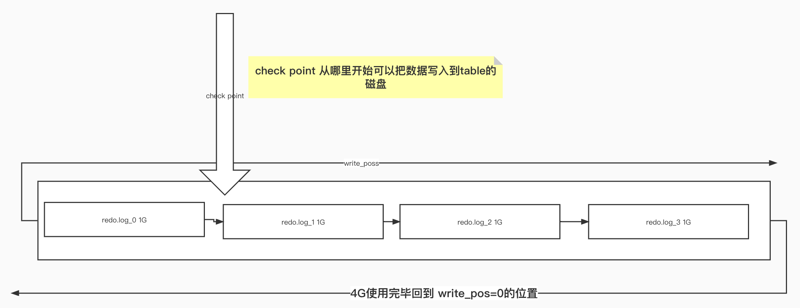

```
1.判断cache是否存在该表的数据,存在缓存把该表的数据设置为失效

2.分析器通过词法语法分析指导这是一条更新语句

3.执行器调用存储引擎找到需要更新的数据地方更新数据


MySQL 更新和查询不同,会涉及到两个重要的日志模块


redo log (重做日志)

binlog (归档日志)
```
## redo log(innodb特有的日志)

```
更新操作的两种方式

1.从磁盘读出数据到内存,找到到数据的位置修改值,写入磁盘
   数据量大情况下把数据读出到内存占用内存多
   数据量大查找非常慢 
2.MySQL使用的方式(WAL技术):
   WAL的全称是Write-Ahead Logging 
   1.先写入日志在写入磁盘,先用日志把数据记录下来,不忙的时候再写入对应表的磁盘
   
   -条更新语句-->innodb把数据写入redo.log,并把数据跟新内存(缓存更新)。

   存在两种情况
      1.更新数据量吧redo.log写满
        停下来吧部分数据写入到对应的表中
        在继续执行吧数据继续写入redo.log日志
      2. 不忙的时候慢慢把待数据写入内存。


redo.log 固定大小

如果把redo.log配置成一个4个文件 每个文件配置的大小为1G


write pos 写入数据 就会向后面移动,
check point pos 就是当前要擦除的位置

当write pos== checkPoint pos代表数据满了。接下来就需要把chekPoint pos 向右推动一次(把数据写入到table中)


这样就保证即使数据库发生异常也不会使数据丢失

```

## binlog
```
binlog(mysql serve层面协议)
为什么会有redo.log和binlog两个日志文件
  最好是MyISAM 没有日志系统,只有bin.log的归档日志(binlog 不具备crash-safe的能力)
innodb是另一个公司开发的Mysql引擎存储插件,innodb 用的是自己实现的日志系统


binlog 和 redo.log的区别
 1.binlog service层日志所有引擎都能使用，redo.log innodb 引擎特有
 2.redo.log 物理日志 记录在那个数据表中修改哪些数据
   binlog逻辑日志 记录的语句的原始逻辑(比如给id=2这余杭的c字段+1)。

 4.redo.log 循环写 空间固定会用完，binlog逻辑日志 文件写到一定带下切换到另一个,并不会覆盖以前的日志


update 数据 redo.log 和 bin.log

update 数据-->数据写入redo.log-->bin.log写入-->事务提交

1.binlog会记录所有的逻辑操作，并且是采用“追加写”的形式
 (恢复数据 使用bindlog日志记录恢复)

怎样将MySQL数据恢复到某个时间

1.找到要恢复的某个时间最近一次的全量备份,并将这个库恢复到临时库
2.从备份的时间开始依次从bin.log取出重放到误删表那个时刻


两个阶段提交
  
  1.将更新操作的数据写入redo.log
  2.将redo.log的状态 prepare,告诉执行器执行完成谁时可以提交事务
  3.执行器生成bin.log
  4.将redo.log从prepare的状态改成commit状态

不用另个阶段提交会造成那些问题

  1.先写入redo.log,在写入binlog
  i=1
  redo.log 写入成功
  当要写bin.log的时候服务器异常重启

  启动执行
  
  由于前面已经讲数据写入redo.log ,值仍然能够恢复回来所以值i任然为1

  而binlog 没有记录这条消息
  
  当我们要恢复临时库时就会发现少了这条数据导致两个库数据不一致


2.先写bin.log 后写redo.log
  binlog 写入
  redo.log 没有写入机器就异常重启

  当机器重启的时候,binlog里面就多了条更新的数据 而 实际数据库没有更新,造成数据不一致
 

```

## 开启innodb redo.log的磁盘持久化
```
innodb_flush_log_at_trx_commit=1
允许inndb数据库从其数据具备恢复功能
sync_binlog=1
每次事务的binlog都会持久化的磁盘,重启数据不会丢失


note redo.log日志
名字为 ib_logfile0 and ib_logfile1
```

## 总结
```
bin.log 在主要作用是用作数据恢复
 1.找最近完全备份
 1.在bin.log找到备份时间为止,以及需要恢复的位置,在binlog拿出数据逐条执行，执行到恢复的时间

 redo.log
   在表中存在大量数据时持久化写入数据的一种优化。(等到空闲在依次执行吧数据写入到表的操作)


运用两阶段提交使着两个操作一致性

1.redo.log 写入对表做了什么动作,将状态设置为prepare

2.写入bin.log数据
  
3.写入成功将调用innodb事务将 redo.log 的状态设置为 commit 


2阶段之前系统崩溃, 重启发现binlog 和 redo.log 数据不完整,数据回滚.

2阶段之后 3之前系统崩溃
  随人redo.log没有 commit,但是 redo.log prepare 状态 并且 binlog 完整,会自动commit.


```