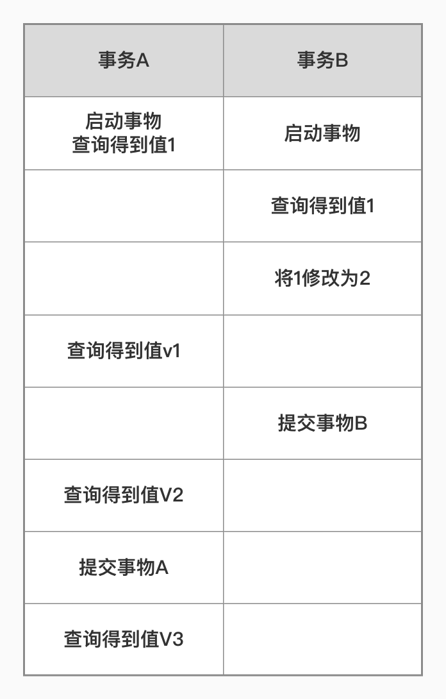
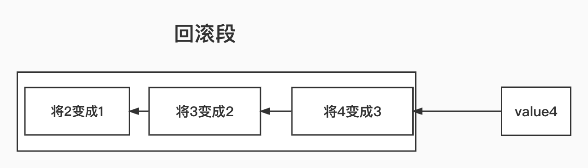

## 事务隔离
```
事务保证一组数据库操作要么全部成功要么全部失败。
MySQL 存储引擎底层用于实现并且支持事物,并不是所有引擎都支持事务。
```

### 隔离性与隔离级别
```
隔离级别越严格,效率越低。


事务的隔离级别:

读未提交:事务还未提交,它的变更就能够被别的事务看到。
读提交:事务必须提交才能够被其他事物看到
可重复读:一个事务执行过程中看到的数据，总是跟这个事务在启动时看到的数据是一致的。(其他事务不可见)
串行化:同一行记录,写会加写锁,读会加读锁,读写锁冲突必须等待前一个事务完成才能够继续接着执行


 
```
### 事务隔离级别图解释

```
mysql> create table T(c int) engine=InnoDB;
insert into T(c) values(1);


在不同的事务隔离级别下事物A会有哪些结果

未读提交: V1=2,(事务B不需要提交就对A可见)

读提交:  V1=1,V2=2(V2在B事务提交之后所以B对A事物可见是)

可重复读:V1=V2=1,V3=2(在A开启事物时,可重复读事务在开启前后的数据保持一致)

串行化:事务B执行将1改成2时会锁住等到事务A提交事务才继续执行.(读写锁冲突会上锁)
```
### 可重复读隔离级别
```
1.开启可重复读事务
2.创建视图

视图开启时创建在未提交事务期间都使用该视图

```

### 读提交隔离级别
```
在每条事物执行之前创建视图
```
### 读未提交
```
直接返回记录最新值,没有视图概念
```
### 串行化
```
直接加锁的方式避免并行访问
```

```
oracle 默认隔离级别 读提交 


mysql默认事务 (可重复提交)
 show variables like 'transaction_isolation';
+-----------------------+-----------------+
| Variable_name         | Value           |
+-----------------------+-----------------+
| transaction_isolation | REPEATABLE-READ |
+-----------------------+-----------------+
1 row in set (0.01 sec)

```

### 可重复读事务运用场景
```
两张表

tb1:余额表
tb2:账单明细

检查 上月余额-这月余额 是否和 账单明细相等


使用可重复读事务隔离 当开始事物 就会创建两个表的视图 
就可以检查计算,即使在计算中有新数据插入 也不会影响数据
因为创建的视图和真实表里面的数据是隔离的。

```

## 事务隔离的实现

```
在MySQL中每记录在更新的时候都会记录一条回滚操作


事务的启动时间不同会看到不同的read-view


MVCC:多版本并发控制(multiple version concurrency control)


如果read-view A视图 看到的回滚日志是将2变成1,当前read-view A视图要想回滚到1 ,当前值执行所有的回滚操作

回滚日志保留时间
答案是，在不需要的时候才删除。也就是说，系统会判断，当没有事务再需要用到这些回滚日志时，回滚日志会被删除。


运用长事务会大量占用内存空间,
 长事务意味着系统里面会存在很老的事务视图
  由于这些事务随时可能访问数据库里面的任何数据，所以这个事务提交之前，数据库里面它可能用到的回滚记录都必须保留，这就会导致大量占用存储空间

事务回滚还占用锁资源

```

## 事务的启动方式
```
显示启动
 begin 或 start transaction。配套的提交语句是commit，回滚语句是rollback。


2. set autocommit=0 线程自动提交关闭掉,
   当你使用 select 的时候事务自动开启，若你不使用 commit 和 rollback 事务会持续到你断开连接


有于有些连接框架连接成功后默认会先执行 set autocommit=0 导致 意外的长事务。
 建议 总是使用set autocommit=1, 通过显式语句的方式来启动事务


更具事务持续时长来查询

select * from information_schema.innodb_trx where TIME_TO_SEC(timediff(now(),trx_started))>60

```